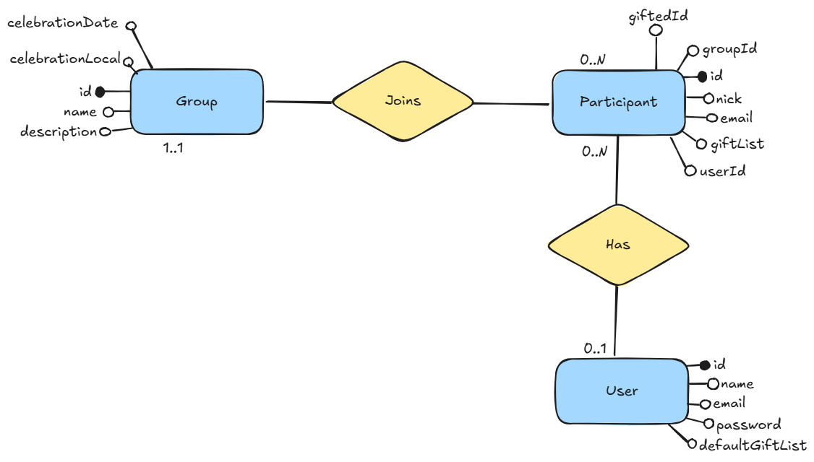

A clean DDD based project to make and manage draws of Kris Kringle.

Before the class, the API was working fine using array repositories implementation. We putted Prisma, and the services of create a group, join and get a participant are okay, but the draw service is not working with Prisma. 

You can check what this project is missing on [todo](#todo).
 

### Endpoints

**_POST_** to create a group  
**_POST_** to add a participant to the group  
**_POST_** to make the matches  
**_GET_** to know who you should gift

More info: [API docs](https://l315pujm1n.apidog.io/)
  

### ER Diagram

 

### Todo

- Fix doDraw function logic (sometimes participants can matche themselves)
- Fix Prisma draw service
- Custom exception hierarchy and its middleware
- User repositories and services
- Authorization and Authentication
- Email invites dispatch
- Endpoint to serve swagger docs
- Tests
